#H1 pp1-parklife readme

Parklife Café 
-------------------------------------------------------------------------------------------------------------

Paklife Café website was made with the intention of increasing local awareness of the business. It is aimed at people looking at somewhere interesting to go for coffee in the Crumlin area , while also helping existing customers feel like part of the family. A cool video advertisement is playable on the site, along with photos, about-us section, the full menu, location map, opening hours, contact details and an email newsletter sign up form. The hope is that it will seem like a fun place to go and the welcoming atmosphere will promote people to return again and again.

[repository link] (https://github.com/gazamcnulty/pp1-parklife)

[https link] (https://github.com/gazamcnulty/pp1-parklife.git)

Table of Contents
--------------------------------------------------------------------------------------------------------------

-Plan
-Business Considerations
-Visual Design
-Features
-User Experience
-Technologies
-Validation + Testing
-Deployment
-Acknowledgements and credits

Plan
--------------------------------------------------------------------------------------------------------------

My plan was to create a website for a realworld business , that did not have much of an online presence. Parklife Café does have an instagram page, but it is not updated often and does not have a lot of followers. A unique website advertising the site, with cool vibes, clear menu and opening hours info, and a sign up sheet could be very useful to this business. I set out to create a site that would give info, entice customers and align with the core values of the business.

Business Considerations
--------------------------------------------------------------------------------------------------------------

-Parklife Café is a new business , which opened in 2021 after the end of the Covid lockdowns in Ireland. The owner is local Dublin resident in Crumlin , who loves the area and wanted to open a café of their own for the nearby residents. Its situated between multiple housing estates and suburbs, the route is used by joggers, people on the way to work, people out for a walk and people walking dogs. Its not near any other businesses or shops, just a small grocery store next door. Because of all this its not targeted at people who will have to travel far to go there ( like a specialist service ) its instead aimed at being a regular hangout for locals, who all know each other and like to pop in for a coffee when they are out and about. This results in the café having a chill friendly vibe, where regulars are cherished, dogs visits are encouraged and its an overall cool place to be in Crumlin Dublin.
I took all this into consideration when planning and designing the site. I wanted to represent the idea of it being a place for locals , dogs, good food, good coffee and good vibes. This steered me towards the aforementioned minimalist and colorful design rather than being too trendy or intimidating. I wanted the site to immediately communicate to any visitors, that the café is a cool, friendly place where everyone is welcome.

Features
--------------------------------------------------------------------------------------------------------------

index.html
----------
-The first thing visible is the header at the top of the page, with the Parklife Café logo on the top right. On the left is the navigation bar , containing an unordered list of list + anchor elements. These allow the user to navigate to any page on the site at any time.
The header section remains consistent across all the pages on the site.

The header has position:fixed; to keep it on top of the page and on a higher plane of below content. This way, even if the user scrolls down away from the top, they can still see the header bar at all times. This is important so they never get lost and always have the option to click to another page or back to homescreen.
The logo is also an anchor element linking to index.html, this is functionally identical to the home link, and is there to reduce the liklihood of people not understanding how to navigate back to the home page.
The navigation links are responsive, the current page is highlighted via a change in the background color and a similar color shows when you hover over the other link. 

-To immediately welcome people to the site, and by extension the Parklife Café, I chose to show a banner video on the landing page. This is the 30 second spec commercial advertising Parklife Café, showing workers and customers smiling and enjoying the food and coffee. The video is muted so as to be unobtrusive and it loops on repeat, so it functions similar to a 'hero-image' but is a moving video instead.

-Below the video on the homescreen , there is small introductory paragraph welcoming people to Parklife Café. This is less detailed than the about.html page, but it adds more personality to the page. It also ensures that even if the user chooses not to visit the about page, they will more than likely see this section at least, and thus get a sense of the cafés identity.

-Following the trend of identity and personality , below this section is a gallery of photos from the café. They have uniform styling, they appear in flexbox for responsiveness and have the same rounded edges and box-sizing. I considered having a seperate gallery all together , but I think this is less relevant for the type of business this page is for. (For example if this was a book club or a charity, which relies on people signing up and taking part, a gallery of images showing people and members might be useful) In this instance, its a café serving food and drink. So the smaller minimalist images work to show some character and give an idea of what the café looks like, without requiring a full seperate page which users would be less likely to navigate too.

-Finally at the bottom of the page, the footer section is a horizontal bar closing the page visually. Its color matches the header, so this communicates the begginning and end sections to the client visually. It features fixed positioning to make sure it is always at the bottom of the page, regardless of screen size. It contains social media links to facebook , twitter, instagram and deliveroo. This serves to increase the outreach of the Parklife Café, as users may choose to interact with the café on other platforms. This can increase the cafés presence on other sites, which can also feed back to this web page. All of this web design is a feedback loop to increase user activity and bring in more customers.

menu.html
---------
in menu.html, the header and footer elements stay the same , for consistent navigation

-Because the business is a café with food and drink , I thought it was important to clearly represent all of the food options and allergens, in a legible, easy to navigate menu. I had considered providing photos, but since the actual menu's in the café don't feature this I thought I should stay true to the café's intention. Similary I thought about bringing in similar design from the home page and feature the looping video in the background. However I decided against this as I felt it would be distracting to the user trying to look at the menu info and make a decision. 
I also kept the design of the menu straight forward, without background images or complex designs, I wanted the info to be as plain and clear as possible. The only distinct design choice was placing the 3 food sections (toasties, breakfast, drinks) into 3 vertical sections, and then having the allergens show as being seperate from this as a horizontal section at the bottom. It is important for health and safety concerns, that food allergens are immediatley visible and not hidden from users.

about.html
----------
in about.html, the header and footer elements stay the same , for consistent navigation

-Because of how important the local community and culture is , I included a detailed about section with photos and info describing the cafe from various perspectives.
The first part features another brief welcome and intro to Parklife Café, below that is a video element for the spec commercial ad. Unlike the mute, looping background video on index.html, this is a normal clickable video with sound. This gives the user the option to watch and hear the video if the want to, it does not play by default as autoplaying videos are not an enjoyable experience for a user visiting a website. 

- In the about section I opted for a grid based design in horizontal sections, with a large photo on one side and a paragraph of info on the left. The photo and paragraph swap sides on each section as you navigate down. This keeps the design fresh but is also relatively simplistic and keeps with the minimalist aesthetic of the other pages. The paragraphs include info about the area, being dog friendly, coffee sourcing, the food, and freshly baked bread.

- The final section of about.html features the goals and ethics. This is a break from the grid based picture and paragraph design above, and instead just features text info. I chose this because the goals and ethics of a company reflect their core values, beliefs and philosophy. I wanted this to be taken seriously and not have it contrasted with a funny picture. Since the subject matter of these sections can be quite serious ( being anti-descrimination, ethical sourcing, sustainable business practices etc) I felt it was more appropriate to have a clean sterile visual, with just a paragraph of text.

contact.html
------------
in contact.html, the header and footer elements stay the same , for consistent navigation

-Because of how important retaining regular and repeat customers is, I included a form for people to sign up to receive an email newsletter about the café. This serves as a way to keep people in touch with the café , to remind them of its existence by way of non-intrusive advertising. It could also lead to a 'rewards' scheme in which people who sign up receive loyalty points for future discounts.

-Because of the fact that the café is situated far away from Dublin city centre, I chose to include an interactive map showing the location and address of the business. Although most people would use google maps if they were unsure of the location, I feel like having the area clearly marked reduces the liklihood of people not knowing exactly where it is . Even if this only affects a few people who choose to go, every little helps for a small local business such as this.

-As fitting with a business, I also put in the opening hours of the business here in the contact section. I had considered putting the opening hours in the footer element on all pages of the site, but I feel like this detracted slightly from the intended cool / minimalist design. I believe most frequenters of the café would be aware it opens during typical café hours, but the opening hours are listed here on the contact page for more specific queries.

Visual Design
-----------------------------------------------------------------------------------------------------
I had initially intended, to have a generic background image of either coffee beans, a hardwood design, or the café itself. However I chose instead to go for a more minimalist approach which fits better with the cafés identity and appearance. I decidied to base it around 3 colors ; the navy/blue which matches the outside paint of the cafe, a lighter tone of the same color for background/distinction, and a light white color for contrast and text info. Although this may not appear particularly striking compared to some large franchises or restaurant websites, I feel the humber design appeals more closely to the identity of Parklife Café.

Technologies
-------------------------------------------------------------------------------------------------------------
Languages:
-HTML5
-CSS

GitHub was used to create and hold the repository of code.
Git was used to control the terminal, add , commit and push to GitHub
GitPod was used for the coding environment, based on Visual Studio Code
Google Fonts was used to import  fonts 'Courier Prime', monospace, 'Source Code Pro', monospace,
Font Awesome was used to import icons 

Validation and Testing 
-------------------------------------------------------------------------------------------------------------

Validation:

The W3C html Validator was used to validate and check for errors in the html code. Upon completion, it found no errors in index.html, menu.html, about.html, contact.html .

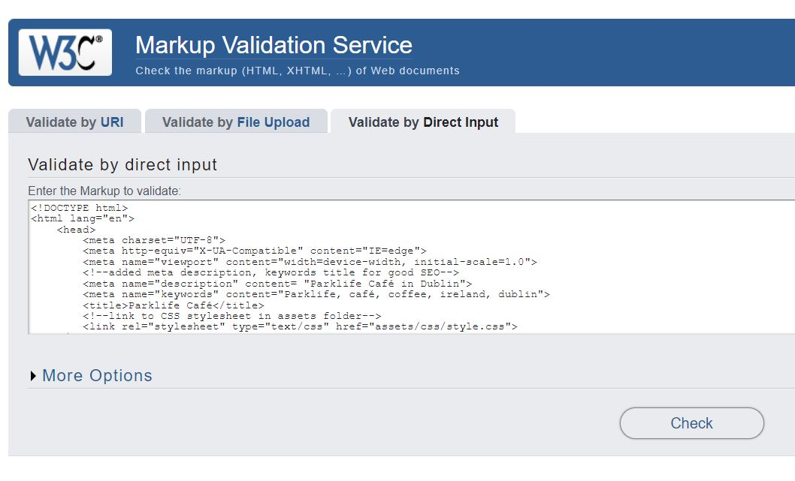
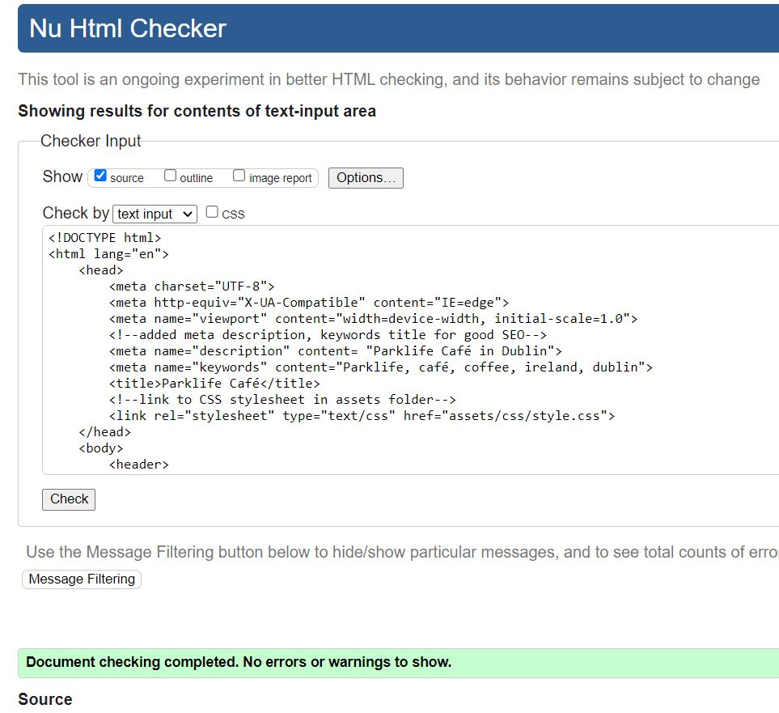

The W3C css Validator
was used to validate and check for errors in the css code. Upon completion, it found no errors in style.css.

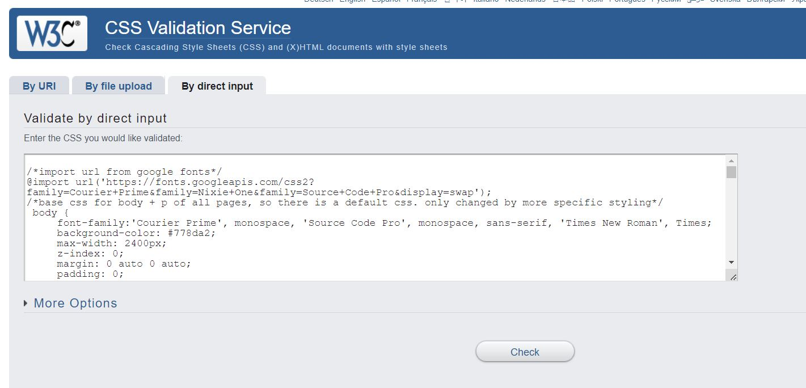
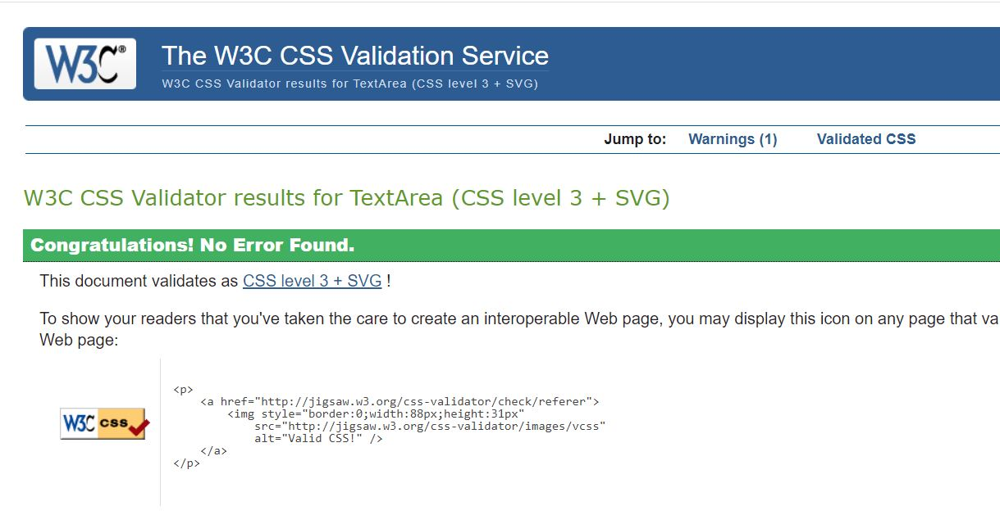

It did point out a warning '	Imported style sheets are not checked in direct input and file upload modes' however this is not a true error, it is a non issue where the validator does not check this and points it out.

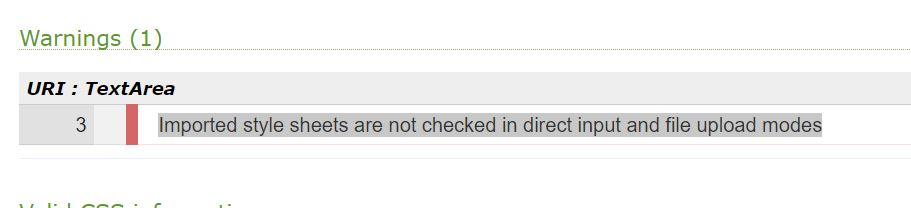

Testing:
I developed the page mainly in Chrome. It was also tested and functioned in Firefox and Edge and performed without issues.
I used google dev tools to test the page in various screen sizes. It performs as intended on multiple screens such as iphone 12, samsung galaxy8 , tablet sizes like ipad air, standard monitor / laptop screens and larger 4K + screens.

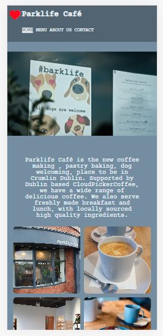

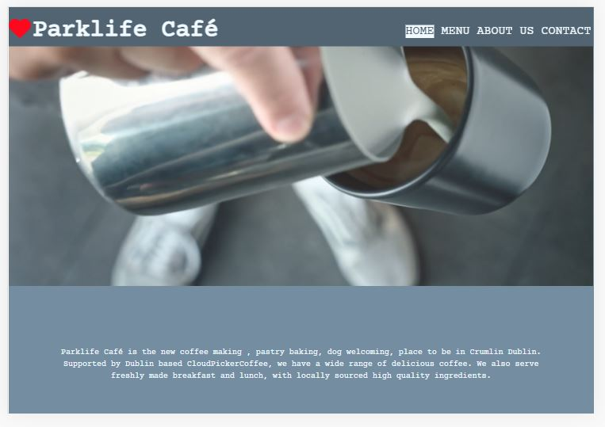

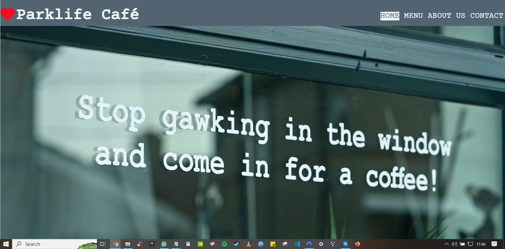

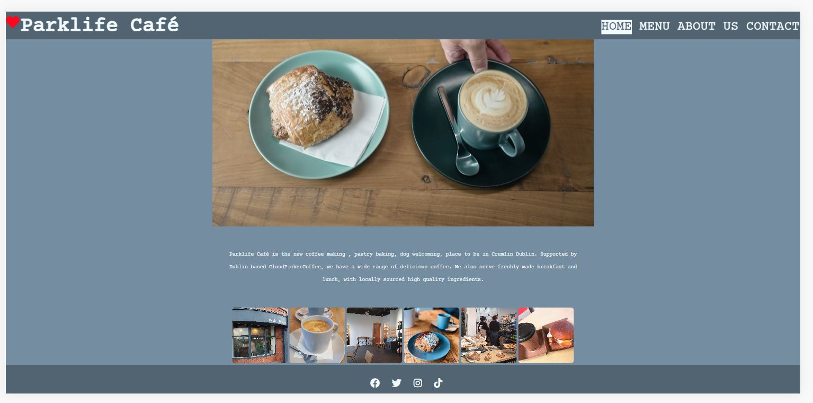

I tested performance for desktop and mobile on pagespeed insights.

Desktop performance gave a score of 98

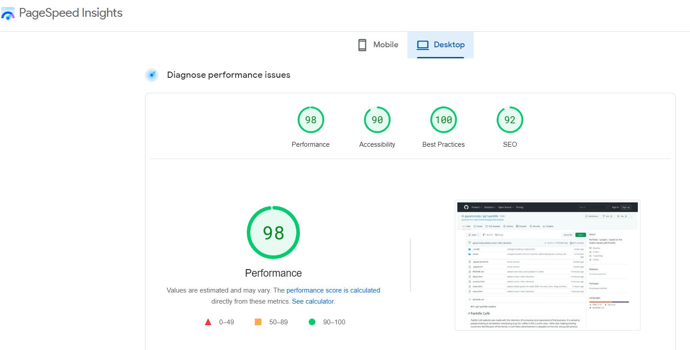

Mobile performance gave a score of 81

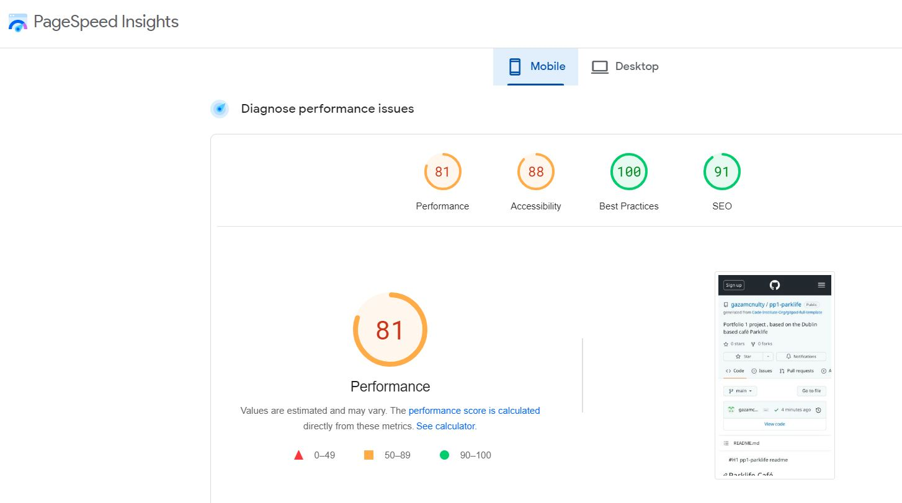

Deployment

From n the pp1-parklife repository on GitHub, click settings tab, then pages. 
Go to source section , deploy from a branch
This should update to show it has been deployed

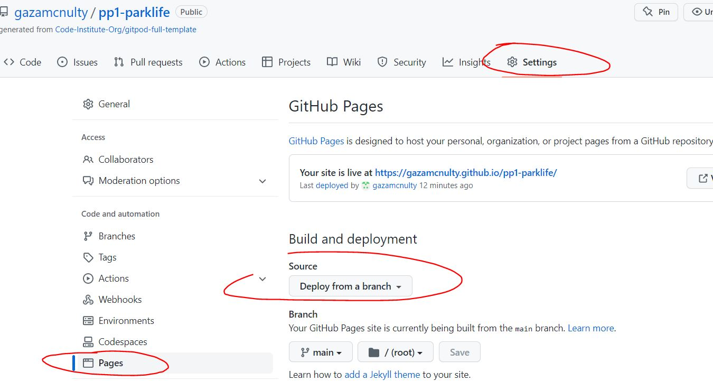

To access the url, in the pp1-parklife repository, click code, then copy the https url .

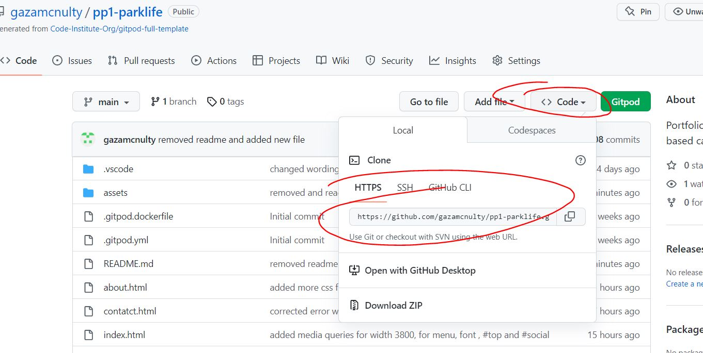

Acknowledgements and Credits
------------------------------------------------------------------------------------------------------------

The Code Institute Lesson Guide was instrumental in providing the base info for html and css essentials.
I revistied the love running project lessons many times, to see how visuals were implemented.

w3schools was invaluable to me during the project, I found a lot of specific examples that allowed me to see how to structure my code to make it work.
[w3schools] (https://www.w3schools.com/)

In particular :
[background images used in about.html] (https://www.w3schools.com/cssref/pr_background-image.php )
[(banner video on index.html)] (https://www.w3schools.com/howto/howto_css_fullscreen_video.asp)
[creating an interactive map window in contact.html] (https://www.w3schools.com/html/html_iframe.asp)

I reviewed some old lessons on freecode camp to assist with my understanding of box model and flexbox

[freecodecamp] (https://www.freecodecamp.org/learn)
[flexbox-lesson] (https://www.freecodecamp.org/learn/2022/responsive-web-design/learn-css-flexbox-by-building-a-photo-gallery/step-1)

I utilised a markdown writing cheatsheet to add info to this readme file 
[markdown-writing-guide] (https://www.markdownguide.org/cheat-sheet/)

My mentor Brian Macharia was provided really good feedback and tips for the site over multiple meetings.

